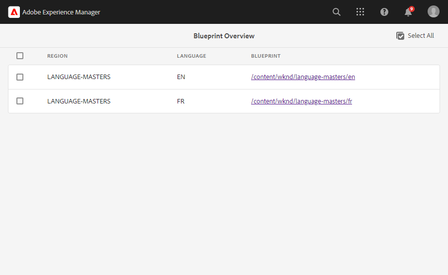
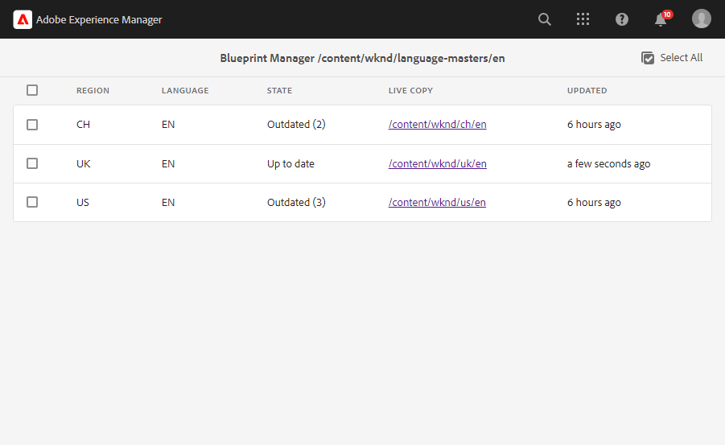
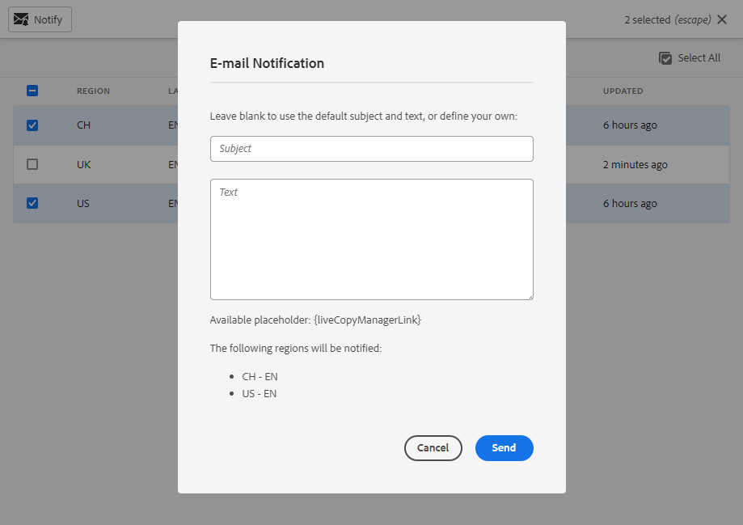
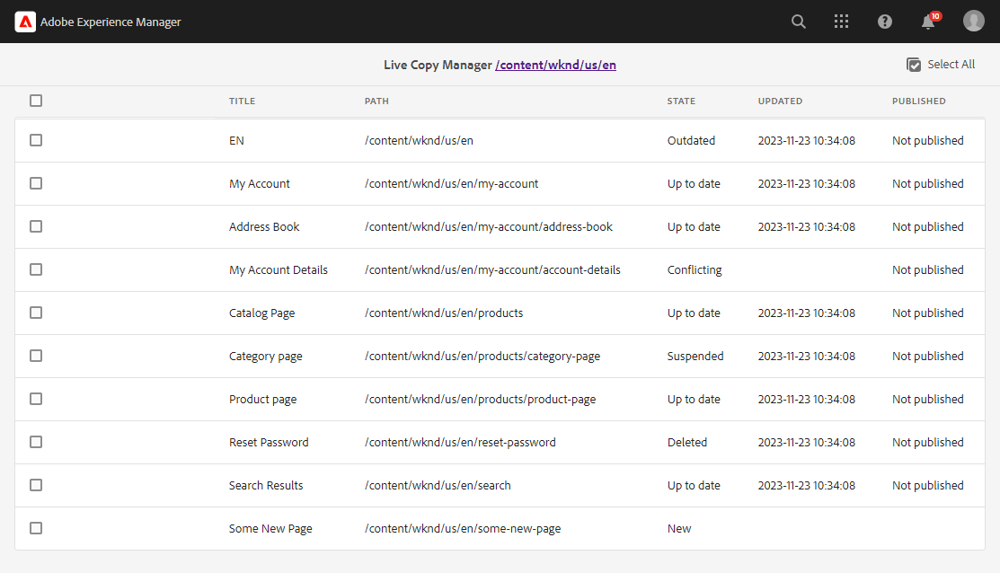
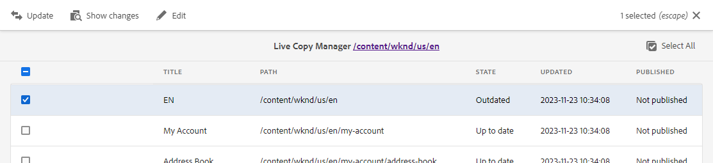

# Valtech - AEM MSM Tools

This is a standalone AEM module which builds on top of the standard AEM MSM functionality and enhances it with convenient tools for day-to-day work the multi-site manager.
It consists of the following tools:
* [Blueprint Overview](#blueprint-overview)
* [Blueprint Manager](#blueprint-manager)
* [Live Copy Manager](#live-copy-manager)

## Blueprint Overview

It has two main functions:
* Show an overview of all the blueprints on the whole platform
* Allow jumping to the Blueprint Manager (see next section) for the chosen blueprint

It can be reached over the AEM Menu `Tools -> Valtech - MSM Tools -> Blueprint Overview`
or via the direct path: `/apps/valtech-msm-tools/pages/blueprintoverview.html`

By adding the blueprint configuration path as a suffix to the URL/path (e.g. `/apps/valtech-msm-tools/pages/blueprintoverview.html/apps/msm/my-site`), one can limit which blueprints will be listed.  

## Blueprint Manager

Gives a general overview of all the live copies for the given blueprint.

It has the following functions:
* List all the live copies of a given blueprint (single-level or nested as well - depends on the configuration)
* Display the status of each live copy (Up-to-date or Outdated, also giving the number of pages which are outdated)
* Display the last rollout date performed on each live copy
* Allow sending a notification e-mail to the content owners of each live copy with a link to the Live Copy Manager (see section bellow)
* Allow jumping to the Live Copy Manager (see next section) for the chosen live copy

It can be reached over the Blueprint Overview page or via direct links with the parameterized path:
`/apps/valtech-msm-tools/pages/blueprintmanager.html/path/to/blueprint/root`

The notification action can be enabled over the configuration (see configuration section).
The sender is the first configured e-mail in the blueprint content owners, and the receivers are all configured content owner e-mails of the chosen live copies.
The content owners must be configured on the blueprint or live copy root page properties:

## Live Copy Manager

Gives a detailed overview of all the pages in a given live copy site.

It has the following functions:
* List all the pages of a live copy (depending on the configuration - can leave out up-to-date pages which normally don't require editor attention)
* For each live copy, show it's state, rollout date and publication status
* Depending on the state and number of selected pages, allow various actions to be performed

It can be reached over the Blueprint Manager page or via direct links with the parameterized path:
`/apps/valtech-msm-tools/pages/livecopymanager.html/path/to/live-copy/root`

#### States

* **Up to date** - page is up-to-date
* **Up to date, not reviewed** - page is up-to-date, but not yet reviewed (also see configuration)
* **Outdated** - page is outdated
* **Not Ready** - blueprint page is modified but not published yet (also see configuration)
* **New** - new page added to blueprint but does not exist in live copy yet
* **Moved** - page was moved in the blueprint
* **Moved / Outdated** - page was moved and updated in the blueprint
* **Suspended** - page updates have been suspended
* **Local Only** - page created and exists only in live copy
* **Unknown** - status unknown
* **Conflicting** - new page under the same path added to blueprint and live copy independently
* **Deleted** - page deleted in blueprint

#### Actions 

* **Update** - synchronizes the page with the blueprint and transitions the state into either `Up to date` or `Up to date, not reviewed` (depends on configuration). 
Shown only for pages in state `New`, `Deleted`, `Outdated`, `Moved`, `Moved / Outdated` and `Conflicting`.
* **Mark as Reviewed** - Shown only for pages in the state `Up to date, not reviewed`. Clicking it will transition the page into `Up to date`
* **Show changes** - goes to the AEM page version comparison tool, showing 
changes on the according blueprint page since the last time the live copy was rolled out. Mind that it does not compare 
the live copy page with the blueprint page, as that would show localized content as changes as well, which normally 
should not be relevant. Shown only when according page versions are still present (were not purged) and the blueprint 
and live copy page have a connection (e.g. won't be shown for `Conflicting`, `Local Only`, etc.) 
* **Edit** - Jumps to the edit mode of the chosen page. Shown for all states except `New` (as the page does not exist in the live copy yet)

## Configurations

There are two services which can and should be configured to tailor the tool to your MSM setup:

### Config Service

Service class: **com.valtech.aem.msmtools.core.services.impl.ConfigServiceImpl**

| Name | Label | Description | Default Value |
|---|:---|:---|:---:|
| blueprintRootMaxDepth | Blueprint Root Max Depth | How deep the page tree traversal will go to look for blueprint sites | 3 |
| resolveNestedLiveCopies | Resolve Nested Live Copies | If the blueprint manager should list nested live copies (live copies of live copies) | true |
| regionPageDepth | Region / Country page depth | At which level the country/region page is in the page tree structure. /content is considered depth 0 | 2 |
| languagePageDepth | Language page depth | At which level the language page is in the page tree structure. /content is considered depth 0 | 3 |
| allowEmailNotificationsAction | Allow e-mail notification action | Show a notification action in the blueprint manager, which allows to send e-mails to live copy site owners | false |
| allowMarkAsDoneAction | Allow review action | Once a page is updated from the blueprint, an additional action becomes available to confirm that it was also reviewed and any potential manual customization done. | false |
| allowVersionCompareAction | Allow version comparison action | Show an action, which would allow the editor to see which changes were done on the blueprint page since the last rollout | true |
| blueprintPagesMustBePublished | Blueprint page must be published | Treat live copy pages as up-to-date, if the blueprint page is not published, or it was not published since the last modification. | false |
| showAllPagesInLiveCopyManager | Show all pages in live copy manager | Disabling this option allows to show only those live copy page, which need attention by the editors | true |
| pageMoveRolloutActionUsed | Page Move Rollout Action Used | On moved blueprint page rollout, live copy pages are moved as well. This depends on your configured live copy rollout actions. | true |

### Notification Service

Service class: **com.valtech.aem.msmtools.core.services.impl.NotificationServiceImpl**

| Name | Label | Description | Default Value |
|---|:---|:---|:---:|
| subject | Default E-mail Subject | Will be used if the editor did not provide a custom notification e-mail subject. |  |
| emailContent | Default E-mail Content | Will be used if the editor did not provide a custom notification e-mail subject. |  |
| siteOwnerEmailPageProperty | Site Owner E-mail Page Property Name | Page property where site owner e-mails are stored (may be of type String[]), to which the notification e-mails will be sent. | siteOwnerEmail |
## Code

The project/code uses java 11 and is compatible only with AEMaaCS. 

### Modules

The main parts of the template are:

* core: Java bundle containing all core functionality like OSGi services, models or servlets
* ui.apps: contains the /apps part of the project, ie JS&CSS clientlibs, components, and templates
* all: a single content package that embeds all of the compiled modules (bundles and content packages)

### How to build

To build all the modules run in the project root directory the following command with Maven 3:

    mvn clean install

To build all the modules and deploy the `all` package to a local instance of AEM, run in the project root directory the following command:

    mvn clean install -PautoInstallSinglePackage

Or to deploy it to a publish instance, run

    mvn clean install -PautoInstallSinglePackagePublish

Or alternatively

    mvn clean install -PautoInstallSinglePackage -Daem.port=4503

Or to deploy only the bundle to the author, run

    mvn clean install -PautoInstallBundle

Or to deploy only a single content package, run in the sub-module directory (i.e `ui.apps`)

    mvn clean install -PautoInstallPackage

### Testing - Unit tests

This show-cases classic unit testing of the code contained in the bundle. To
test, execute:

    mvn clean test
    
### Embedding Into Existing Projects

You can embed this tool into other projects by creating a local maven repo in your project by adding the following 
repo definition in your main POM:

    <repositories>
        <repository>
            <id>local-repo</id>
            <url>file:nonadobedependencies</url>
            <name>Repository</name>
            <releases>
                <enabled>true</enabled>
                <updatePolicy>never</updatePolicy>
            </releases>
            <snapshots>
                <enabled>false</enabled>
            </snapshots>
        </repository>
    </repositories> 
    
Afterwards, download the desired release package and execute the following command:

    mvn install:install-file -Dfile={downloaded package file} -DgroupId=com.valtech.aem -DartifactId=msm-tools.all -Dversion={version} -Dpackaging=zip -DlocalRepositoryPath=./nonadobedependencies

The last step is to include the package as a dependency in your `all` package, by using the dependency definition:

    <dependency>
      <groupId>com.valtech.aem</groupId>
      <artifactId>msm-tools.all</artifactId>
      <version>{version}</version>
      <type>zip</type>
    </dependency>

And including into the `embeddeds` definition of your `filevault-package-maven-plugin`:
    
    <ebedded>
      <groupId>com.valtech.aem</groupId>
      <artifactId>msm-tools.all</artifactId>
      <type>zip</type>
      <target>{location of your other vendor packages under /apps}</target>
    </ebedded>

## License

The AEM MSM Tools module is licensed under the [MIT LICENSE](LICENSE).